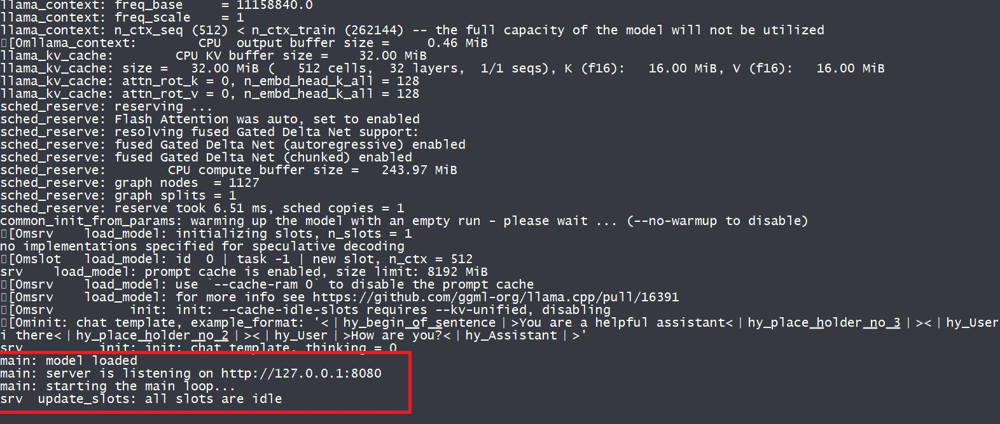
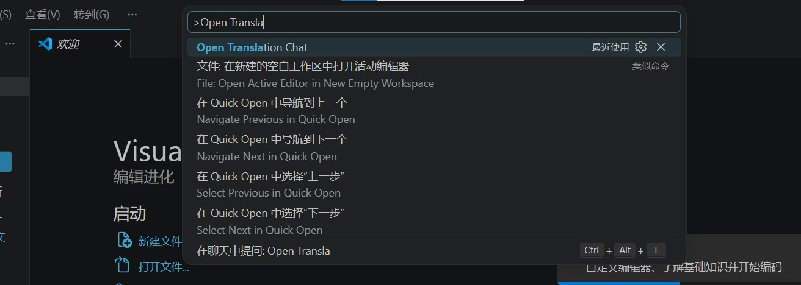
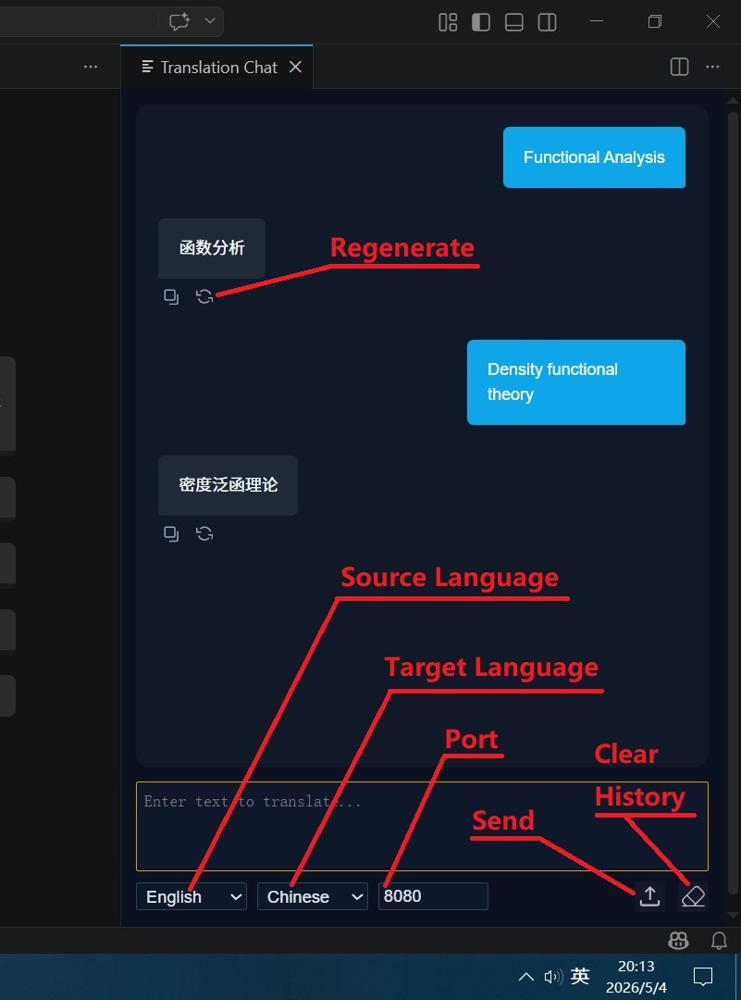
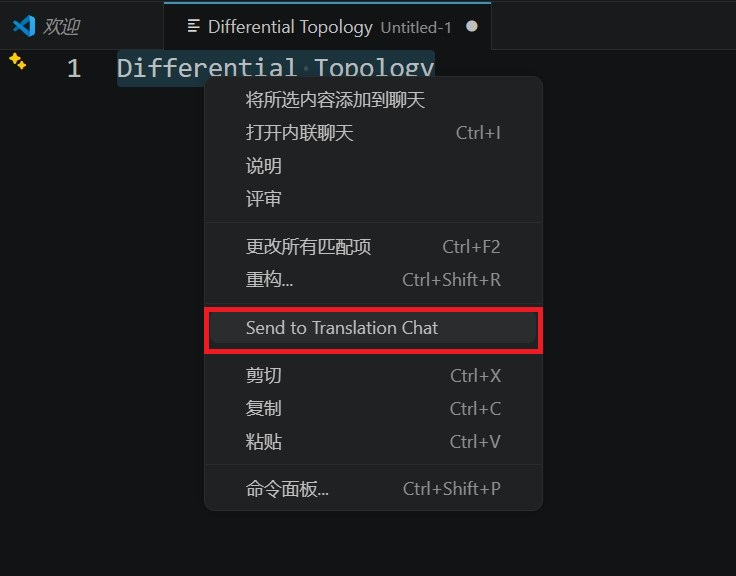
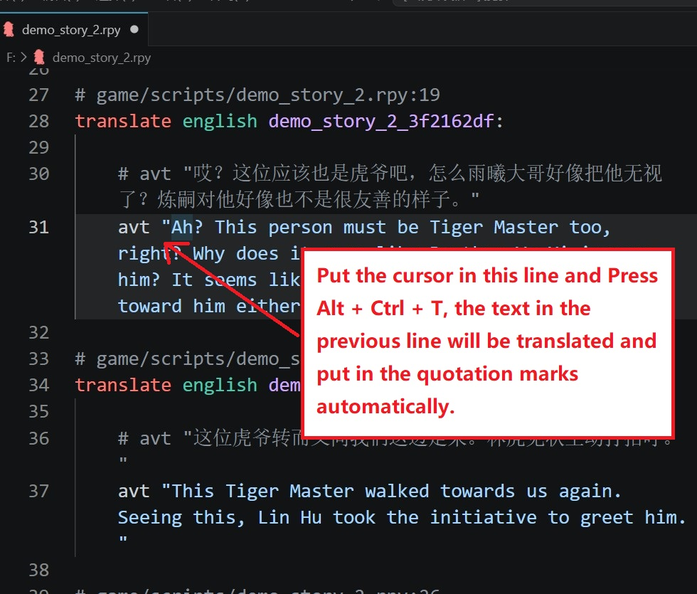

# VisualNovelTranslator

This is a translator plugin for vscode base on Tencent HY-MT1.5 model. You need to download the model on hugging face and use `llama.cpp` to create a local sever on your PC to use this extension.

## Create a local translation server

- Download HY-MT1.5 model on [hugging face](https://huggingface.co/tencent/HY-MT1.5-1.8B-GGUF/tree/main) (or the mirror website, e.g. [hf-mirror](https://hf-mirror.com/tencent/HY-MT1.5-1.8B-GGUF)). `HY-MT1.5-1.8B-Q4_K_M.gguf` model is good enough for most cases.
- Download compiled `llama.cpp` on [github](https://github.com/ggml-org/llama.cpp/releases/), you can choose any recent version, `Windows x64(CPU)` version is fast enough and there is no any other dependencies.
- Run the command below in `cmd` or `powershell`
```bat
llama-server.exe -c 4096 -m E:\Programming\NN-Framework\HY-MT1.5-1.8B-Q4_K_M.gguf --context_shift -np 1 --port 8080
```
when you see the text shown in the image below,  the server is ready.


The meaning of the parameters:
- `-m`: The path of the model.
- `-c`: The size of the context.
- `-np`: The number of threads. Only 1 thread is fast enough.
- `--port`: The port of the server.
- `--context_shift`: Always use this option to allow the model shift the KV cache if it exceeds the context size.

## Usage of the plugin

### Use the chat window

Press `Ctrl + Shift + P` to show all the command, and type `Open Translation chat`,

Click this command and open the chat panel.

Sometimes the model does not work properly, for example, it does not translate the text to the target language. You can click the `regenerate` button to try again or click the `Clear` button to clear the translation history.

### Translate the selected text

Right click and click the `Send to translation chat` command. The selected text will be send to the chat panel and translated automatically.


### Translate the renpy script

When you edit the `rpy` translation file (the script file of renpy engine), the text can be translated automatically by press `Ctrl + Alt + T`

The picture above shows a translation file of renpy. Just put the cursor on the line below the comments, and press `Ctrl + Alt + T`. The text in the quotation marks on the previous line will be translated and fill into the current line automatically.